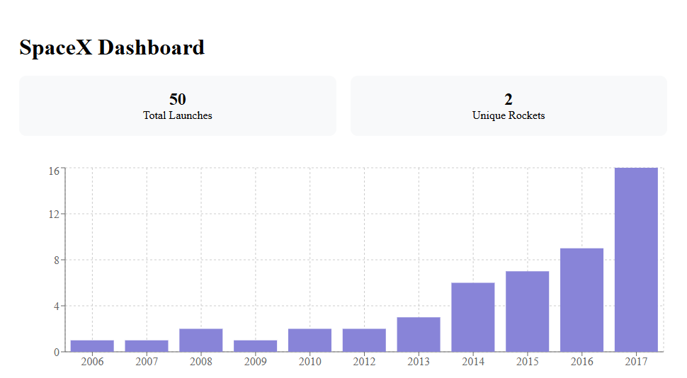

# 🚀 Lunar Solar React Dashboard

A **marketing analytics dashboard** built with **React, Redux Toolkit, GraphQL (Apollo Client)**, and **Recharts**.  
It simulates a KPI & data visualization platform for a marketing tech environment, inspired by the **Lunar Solar Group** Senior Frontend Engineer job description.

🔗 **Live Demo**: [https://lunar-solar-react.vercel.app/](https://lunar-solar-react.vercel.app/)  
📚 **Storybook**: [https://lunar-solar-react-storybook.vercel.app/](https://lunar-solar-react-storybook.vercel.app/)

---

## 📸 Screenshots

**Dashboard Overview**  


---

## 🛠 Tech Stack

- **React 18** + **Vite** – Modern and fast dev environment.
- **Redux Toolkit** – Global state management for KPIs and launches.
- **Apollo Client** – GraphQL integration with SpaceX public API.
- **Recharts** – Responsive charts and KPIs visualization.
- **TypeScript** – Strict typing for maintainability.
- **ESLint + Prettier** – Code quality and formatting.
- **Vercel** – Deployment & hosting.

---

## 📂 Project Structure

```plaintext
src/
 ├── components/       # Reusable UI components (KpiCard, LaunchChart, Dashboard)
 ├── graphql/          # Apollo Client setup & GraphQL queries
 ├── store/            # Redux Toolkit slices, hooks, and thunks
 ├── App.tsx           # Application entry point
 └── main.tsx          # React root with Providers (Redux + Apollo)
```

---

## 🔑 Features

- **KPI Cards** – Total launches, unique rockets.
- **Launch Chart** – Launches grouped by year.
- **GraphQL Data Fetching** – SpaceX public API.
- **Redux Integration** – Centralized data & loading/error states.
- **TypeScript Strict Mode** – Strong typing for safer code.
- **Performance Optimization** – Memoized selectors & components.
- **Responsive Layout** – Works on desktop & mobile.

---

## 📦 Installation & Setup

```bash
# Clone the repository
git clone https://github.com/icaroxavier/lunar-solar-react.git
cd lunar-solar-react

# Install dependencies
npm install

# Start development server
npm run dev

# Build for production
npm run build

# Preview production build
npm run preview
```

---

## 🔍 Environment Variables

No private keys are required for this demo, but you can change the GraphQL endpoint in  
`src/graphql/client.ts`:

```ts
uri: 'https://spacex-production.up.railway.app/'
```

---

## 👤 Author

**Ícaro Xavier**  
Frontend Engineer | React, Redux, GraphQL, UI/UX  
[LinkedIn](https://www.linkedin.com/in/icaroxavier/) • [GitHub](https://github.com/icaroxavier)
